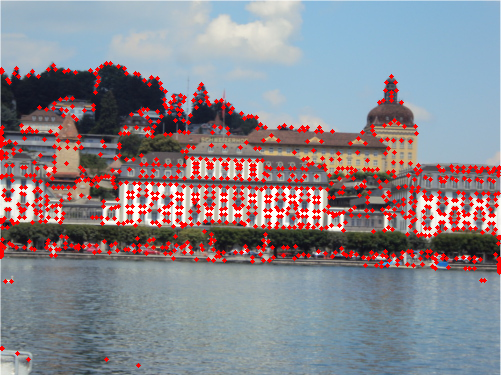
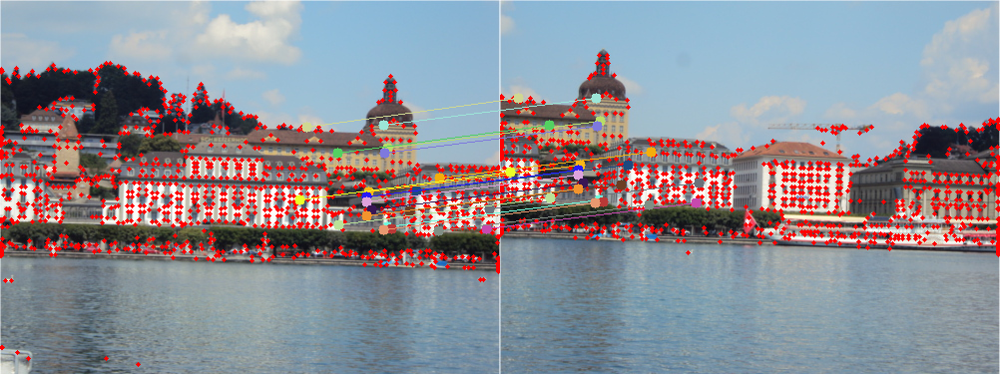

# 🔍 Feature Matching with LBP & Corner Detection (FAST & Harris)

This project implements **corner detection** (FAST & Harris) and **feature matching using LBP descriptors** in both **Python** and **C++** with OpenCV. It allows for feature extraction, comparison, and visualization of keypoints and matching results.

## 🚀 Features  
- **FAST** & **Harris** corner detection 🔥🏁  
- **LBP (Local Binary Pattern) descriptor matching**  
- **Implementation in Python & C++** 💻🐍  
- **Comparison between custom and OpenCV's built-in implementations**  
- **Image visualization of detected keypoints & matching results**  


## 📁 Project Structure
```
FeatureDetection/
images/                # Image dataset for testing and results visualization
docs/                  # Documentation, including research papers and result images
cpp/                   # C++ implementation
   src/                   
       descriptors.cpp    # Descriptors extraction and matching algorithm implementation
       fast.cpp           # Fast corner detection implementation
       harris.cpp         # Harris corner detection implementation
       main.cpp           # C++ entry point for testing the algorithms
python/                # Python implementation
   notebooks/             
       test.ipynb         # upyter notebook for testing the Python implementation
   src/                   
       descriptors.py     # Descriptors extraction and matching algorithm implementation
       fast.py            # Fast corner detection implementation
       harris.py          # Harris corner detection implementation
requirements.txt       # List of required dependencies
cmake-build-debug/     # C++ compilation and installation
README.md              # Project documentation
```

## 📥 Installation  

### 📌 Requirements  
🔹 **Python** (≥ 3.x)  
🔹 **OpenCV** (for Python & C++)  
🔹 **CMake** and **g++** (for C++ version)  

### 🐍 Python Installation  
1. Install dependencies::  
```bash
pip install -r requirements.txt
```

2. Open and run the Jupyter notebook:
```bash
jupyter notebook test.ipynb
```
###  C++ Compilation & Execution
1. Navigate to the cmake-build-debug folder:
```bash
cd cmake-build-debug
```

2. Build the C++ project using CMake:
```bash
cmake --build .
```
3. Run the compiled program:
```bash
./FeatureDetection
```

## 📷 Example Results
Below are some example results for corner detection and feature matching:

### 🔹 Harris Corner Detection
Here are some example Harris Corner Detection results: 



### 🔹 FAST Corner Detection
Here are some example 🔹 FAST Corner Detection results:


### 🔹 LBP Feature Matching
Here’s an example of feature matching using the LBP descriptor:



## 📜 License
This project is licensed under the MIT License.